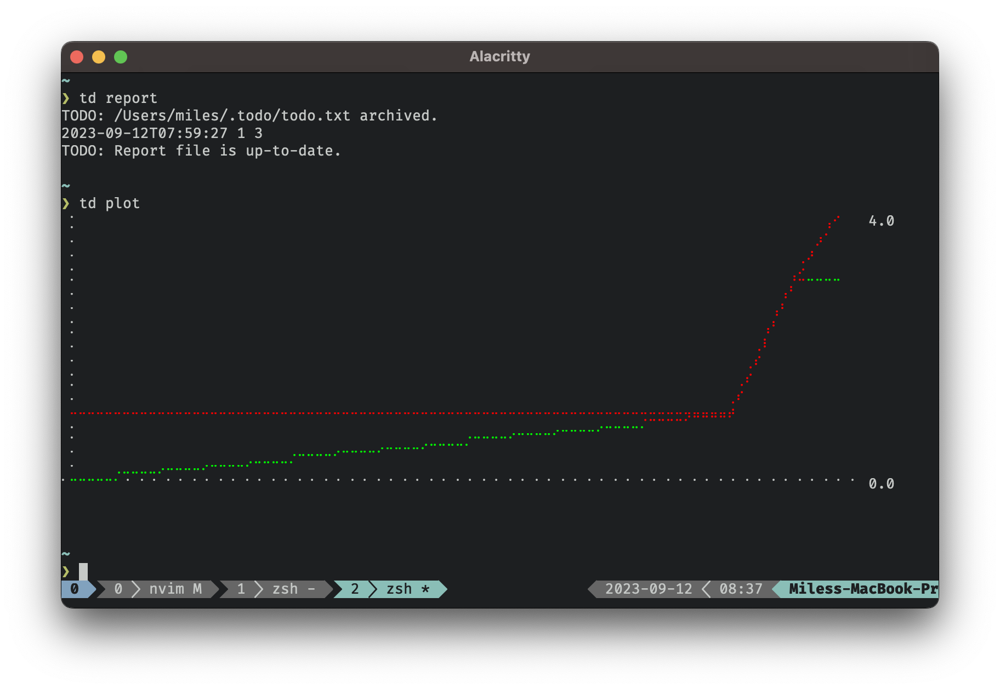

# todo-plot

A simple, useless plotter for todo.txt report files, use as a
[todo.txt action](https://github.com/todotxt/todo.txt-cli/wiki/Creating-and-Installing-Add-ons#installing-add-ons)
for a simple plot of your todo progress.

